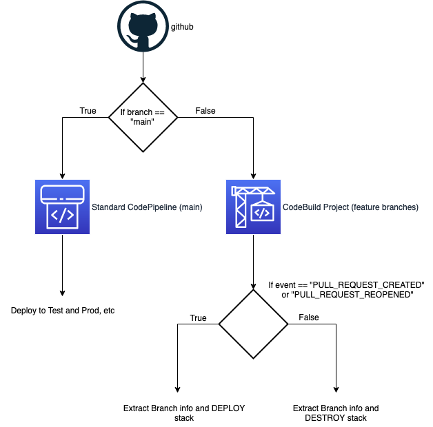

# CDK PR 2 Pipeline

There are times when [feature-based development with git](https://www.atlassian.com/git/tutorials/comparing-workflows/feature-branch-workflow) is preferred.

According to Atlassian: "The core idea behind the Feature Branch Workflow is that all feature development should take place in a dedicated branch instead of the main branch. This encapsulation makes it easy for multiple developers to work on a particular feature without disturbing the main codebase. It also means the main branch will never contain broken code, which is a huge advantage for continuous integration environments."

Currently, AWS CodePipeline does not natively support constructing a stack when a PR is created in GitHub. This construct enables this functionality.

## Setup

- add your github token to AWS Secrets Manager with the key named `github-token`
  - this can be changed in `example/pipeline-stack.ts` where the `sourceAction` is defined
- alter the github info in `example/example-app.ts` for your project
- from the root directory run `npm install` to fetch the dependencies
- ensure you have [bootstrapped](https://docs.aws.amazon.com/cdk/latest/guide/bootstrapping.html) cdk for your account
- `npm run deploy` to deploy into your account

# Try It

- in your AWS web console, browse to CloudFormation
  - you should see a deployment for the `main` branch
- browse to CodePieline and you should see a pipeline for `main`
- browse to CodeBuild and you should see a Project for PR2Pipeline
- in github, make a new branch and generate a pull request
- this should have triggered PR2Pipeline project, which in turn will deploy a new stack for the branch in CloudFormation
  - you will have to manually approve deployment
- in github, close the pull request
  - you should now see the stack being deleted

## How it works

- A custom Codebuild project is made that listens for specific webhook events from github, `PULL_REQUEST_CREATED`, `PULL_REQUEST_REOPENED`, and `PULL_REQUEST_MERGED`.
  - If the event is `PULL_REQUEST_CREATED` and `PULL_REQUEST_REOPENED`, then it builds a new stack for that branch
  - If it is `PULL_REQUEST_MERGED`, then it deletes the stack for that branch
- Everything else is a standard codepipeline that is listening to the `main` branch

## Example

An example of how to integrate into `cdk.pipelines` is provided in `example/pipeline-stack.ts`. In particular, note how it is checking the branch name to determine if it should do the normal pipeline actions for test/prod/etc, or if it should deploy into dev account the stack based on the feature branch identified in the webhook.
A generic representative application is provided in the example.

## Notes about the example

- the github token has been stored in Secrets Manager
- the pr-to-pipeline construct is only deployed when the branch is `main`, not for any feature branch, since it is what stands up the feature branch stack
- any s3 buckets created by this example will have to be manually deleted